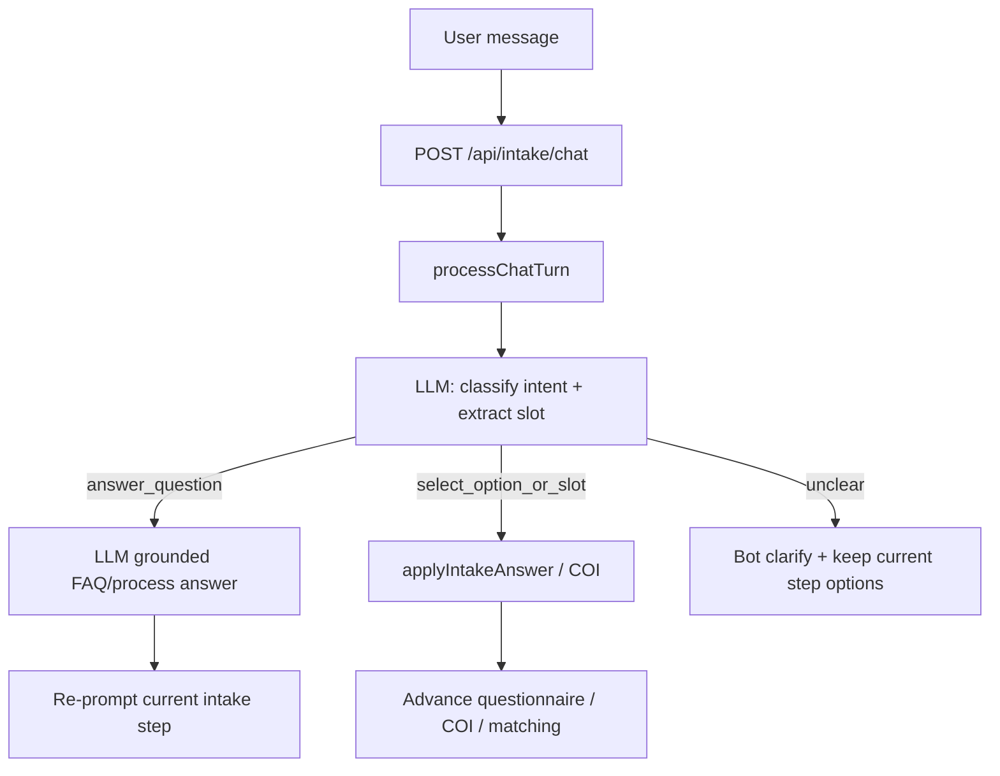

# Complete AI Intake Chatbot (Barristrly)

## Context
[`Untitled-1`](/Users/macbookpro/.cursor/projects/Users-macbookpro-Desktop-unifiedsalon/uploads/Untitled-1-L1-L254-0.txt) defines the conversational intake (practice areas → engagement → jurisdiction → budget → details/urgency → masked lead capture). Most of that taxonomy already lives in [`lib/intake/questionnaire.ts`](/Users/macbookpro/Desktop/barristrly/lib/intake/questionnaire.ts) and the rule engine in [`lib/intake/chat-engine.ts`](/Users/macbookpro/Desktop/barristrly/lib/intake/chat-engine.ts). Today free-text Q&A is only shallow FAQ keywords, and [`lib/intake/llm.ts`](/Users/macbookpro/Desktop/barristrly/lib/intake/llm.ts) only optionally rephrases via Ollama (not configured).

**Default AI wiring:** OpenAI-compatible Chat Completions (`OPENAI_API_KEY`, optional `OPENAI_BASE_URL`, `OPENAI_MODEL` default `gpt-4o-mini`), with fallback to existing Ollama (`OLLAMA_BASE_URL`), then deterministic rules if neither is configured. No design/UI overhaul — enhance turn handling behind the current chat UI.

## 1. Align questionnaire content with Untitled-1
Update [`lib/intake/questionnaire.ts`](/Users/macbookpro/Desktop/barristrly/lib/intake/questionnaire.ts) so prompts/options match the merged flow from the doc:
- Keep expanded verticals (Legal Notices, Immigration, Travel Bans + full corporate/civil set already present)
- Ensure engagement model, jurisdiction list, budget tiers, fee structures, matter summary, urgency Yes/No, and lead masking consent match Steps 3–7 of the advanced flow
- Sync greeting / privacy consent strings with the doc’s anonymity wording
- Expand [`lib/intake/faq-corpus.ts`](/Users/macbookpro/Desktop/barristrly/lib/intake/faq-corpus.ts) with process FAQs (privacy masking, when lawyers see contact details, jurisdictions, COI timing, fees)

Bump `barristrly_chat_flow_v` in the client if step shape changes so stale sessions reset cleanly.

## 2. Real AI provider layer
Replace the Ollama-only helpers in [`lib/intake/llm.ts`](/Users/macbookpro/Desktop/barristrly/lib/intake/llm.ts) with:
- `chatCompletion(messages)` — OpenAI-compatible first, then Ollama
- `classifyIntakeTurn({ session, userText, currentStep, options })` → JSON `{ intent: "answer_question" | "provide_slot" | "select_option" | "unclear", selectedOption?, slotValue?, answer? }`
- `answerUserQuestion({ session, userText })` — short grounded reply using questionnaire FAQ + current step context; never invent lawyer names/fees; remind anonymity rules
- Wire `parseFreeTextSlot` through the same provider (already defined but unused)

Document required env vars in `.env.example` (create if missing): `OPENAI_API_KEY`, `OPENAI_BASE_URL`, `OPENAI_MODEL`, keep `OLLAMA_*` as fallback.

## 3. Make the chat engine AI-aware while preserving the state machine
In [`lib/intake/chat-engine.ts`](/Users/macbookpro/Desktop/barristrly/lib/intake/chat-engine.ts) / [`app/api/intake/chat/route.ts`](/Users/macbookpro/Desktop/barristrly/app/api/intake/chat/route.ts):
- On free-text turns (not exact quick-reply clicks), call `classifyIntakeTurn` before failing with “I didn't catch that”
- If `answer_question`: append AI answer, then re-prompt the same intake/COI step with the same options (user can ask anything and still continue)
- If `select_option` / `provide_slot`: map into `applyIntakeAnswer` (or COI yes/no) and advance
- Keep exact option-button clicks on the fast deterministic path (no LLM latency)
- Allow Q&A during `intake` and `coi` states (not only intake); block legal advice hallucinations with a system guardrail
- Keep matching → auth → payment pipeline unchanged after questionnaire + COI complete

## 4. Client polish for “ask or proceed”
In [`components/intake/ai-chat-bot.tsx`](/Users/macbookpro/Desktop/barristrly/components/intake/ai-chat-bot.tsx):
- Placeholder copy: e.g. “Ask a question or choose an option below…”
- Show typing/busy state while AI classifies
- Keep quick-reply chips as the primary proceed path

## 5. Verify
- Unit/script coverage for classifier fallbacks (no key → option substring match) and questionnaire completion gates
- Manual path: open `/intake` → ask “Will lawyers see my phone?” → get privacy answer → still see category options → complete category→sub→engagement→jurisdiction→budget→details→contact→COI→matches
- Confirm without `OPENAI_API_KEY` the wizard still works via quick replies (graceful degradation)
